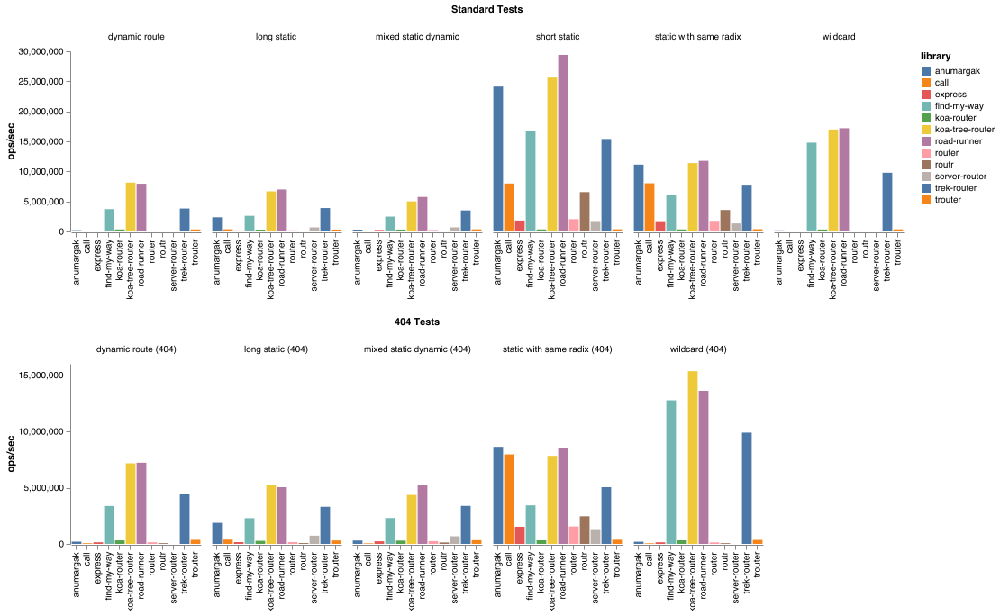

# router-benchmark

[](http://standardjs.com/) [](https://travis-ci.org/delvedor/router-benchmark)

Benchmark of the most commonly used http routers.

Tested routers:

- [find-my-way](https://github.com/delvedor/find-my-way)
- [call](https://github.com/hapijs/call)
- [express](https://www.npmjs.com/package/express)
- [koa-router](https://github.com/alexmingoia/koa-router)
- [koa-tree-router](https://github.com/steambap/koa-tree-router)
- [router](https://github.com/pillarjs/router)
- [routr](https://github.com/yahoo/routr)
- [server-router](https://github.com/yoshuawuyts/server-router)
- [trek-router](https://www.npmjs.com/package/trek-router)
- [road-runner](https://github.com/parisholley/road-runner)
- [anumargak](https://github.com/node-muneem/anumargak)
- [trouter](https://github.com/lukeed/trouter)

This benchmarks aims to test only http routers, so the method handling should be included.  
Do you know other routers? [PR](https://github.com/delvedor/router-benchmark/pulls)! :D

<a name="results"></a>
## Results
*These benchmarks where taken under node v11.10.1, on a MacBook Pro 15-inch 2018 (i9, 32GB of RAM).*


### Run the benchmarks
Do you wan to run the benchmarks by yourself?  
Run the following:
```bash
git clone https://github.com/delvedor/router-benchmark
cd router-benchmark
npm i
npm start
npm chart
open results.png
```

<a name="features"></a>
## Router features
| Router | Framework independent    | Decode URI    | Querystring handling   |  Regex route support | Multi-parametric route support |  Max parameter length |
| :------------ | :------------ | :------------ | :--------------------- | :------------------- |:------------------------------ |:--------------------- |
| `find-my-way` | &#10003; | &#10003; | &#10003; | &#10003; | &#10003; | &#10003; |
| `call` | &#10003;  | &#10003; | &#10007; | ? | ? | ? |
| `express` | &#10007;  | &#10003; | &#10003; | &#10003; | &#10003; | &#10007; |
| `koa-router` | &#10007;  | &#10007; | &#10007; | &#10003; | &#10003; | &#10007; |
| `koa-tree-router` | &#10007; | &#10007; | &#10007; | &#10007; | &#10007; | &#10007;  |
| `router` | &#10003;  | &#10003; | &#10003; | &#10003; | &#10003; | &#10007; |
| `routr` | &#10003; | &#10003; | &#10003; | &#10007; | &#10007; | &#10007; |
| `server-router` | &#10003; | &#10003; | &#10007; | &#10007;| &#10007; | &#10007; |
| `trek-router` | &#10007; | &#10007; | &#10007; | &#10007; | &#10007; | &#10007; |
| `road-runner` | &#10003; | &#10007; | &#10007; | &#10007; | &#10007; | &#10007;  |
| `anumargak` | &#10003; | &#10003; | &#10003; | &#10003; | &#10003; | &#10007; |

*Did you find incorrect data in the above table? Please send a pr!*

<a name="how"></a>
## How the benchmark is taken

To emulate a real world situation every router registers the following routes:
```
{ method: 'GET', url: '/user' },
{ method: 'GET', url: '/user/comments' },
{ method: 'GET', url: '/user/avatar' },
{ method: 'GET', url: '/user/lookup/username/:username' },
{ method: 'GET', url: '/user/lookup/email/:address' },
{ method: 'GET', url: '/event/:id' },
{ method: 'GET', url: '/event/:id/comments' },
{ method: 'POST', url: '/event/:id/comment' },
{ method: 'GET', url: '/map/:location/events' },
{ method: 'GET', url: '/status' },
{ method: 'GET', url: '/very/deeply/nested/route/hello/there' },
{ method: 'GET', url: '/static/*' }
```
Then the following routes are tested:
```
short static: { method: 'GET', url: '/user' }
static with same radix: { method: 'GET', url: '/user/comments' }
dynamic route: { method: 'GET', url: '/user/lookup/username/john' }
mixed static dynamic: { method: 'GET', url: '/event/abcd1234/comments' },
long static: { method: 'GET', url: '/very/deeply/nested/route/hello/there' },
wildcard: { method: 'GET', url: '/static/index.html' }
all together: all the above at the same time
```
Every test is executed 1 million times, the time is taken with `process.hrtime()`, the final result is expressed in operations per second.

<a name="todo"></a>
### TODO:
- [ ] Add a list of the supported features by every router

<a name="license"></a>
## License

[MIT](https://github.com/delvedor/router-benchmark/blob/master/LICENSE)

Copyright © 2017 Tomas Della Vedova
